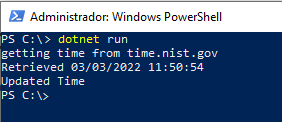

# Update Windows System Time

this project was created to retrieve time from a NTP server and update the Operating System Time,
currently only is supported.

You can run it by:

```powershell
dotnet run [-- --url time.nist.gov]
```



### Note about the Elevated Permission

Windows require a elevated privilege to update system time though [Win32SetSystemTime](src/UpdateWindowsTime/Time/WindowsSystemTime.cs).
So you need to run this as an administrator, note: **I don't recommend that you do this directly**, instead download this project, read the code 
and run the project. A program with elevated privilege can do so many dangerous things on the system, so be very careful.

### Motivation

My computer doesn't update time since 2015 due an error that I can't figure out. I created this project to update system time and run it once a month
just to avoid the need of checking a NTP website and update it manually.